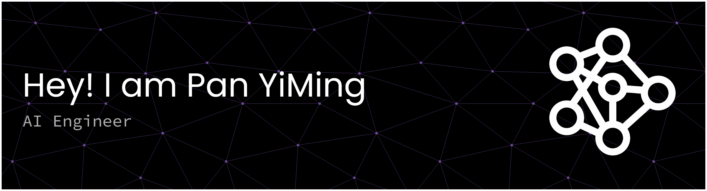

I'm deeply passionate about Artificial Intelligence, Python programming, NLP, and in my free time, game development. Welcome to my GitHub profile!
### About me

- 22 years old
- Bachelor's degree in artificial intelligence.
- Natural Language Processing is fascinating to me, driving my curiosity towards LLMs, NER/NEL, and IR.
- I love coding in Python, especially making entertaining projects for me and my friends to try.

### What I'm currently working on

- **Tulip Bot**: A bot that manages the economy of a discord server, as well as introducing minigames and a combat RPG system.
- **OOVerseer**: A program that streamlines the process of detecting and describing entity terms considered Out-of-Vocabulary with respect to a given embedding model.

### My skills

- Programming languages: **Python** (_proficient_), **C++** (_currently learning_)
- AI & machine learning: **Tensorflow, PyTorch, scikit-learn**, **transformers**
- Database Management & Datawarehousing: **PostgreSQL**

### Fun facts

Apart from coding, I love:
- Playing guitar
- Reading and writing stories
  -  I'm currently writing _Ride the Wind_, a story set in a steampunk setting about four friends longing for the skies.
  -  Prologue: https://novlr.org/share/6917a0ac9463c60017507ef4/6903ab107618fb0009d02874
- Gaming
- Watching films
